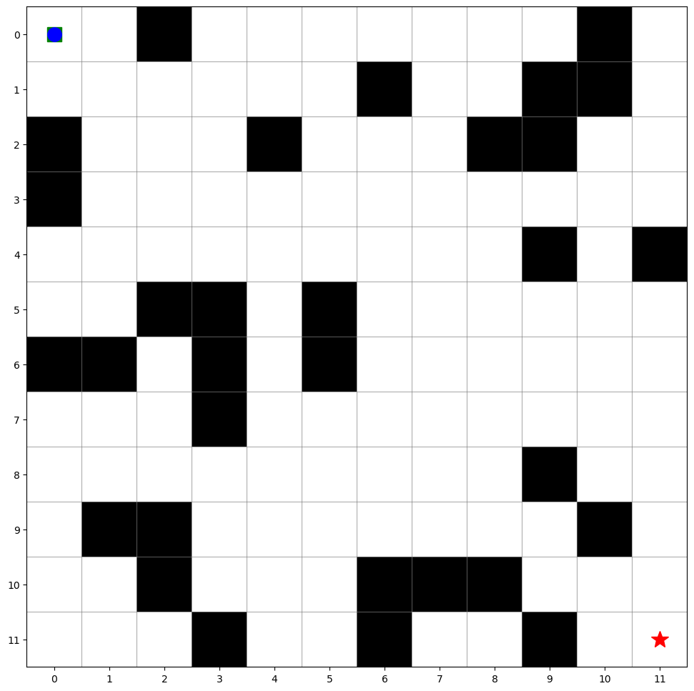
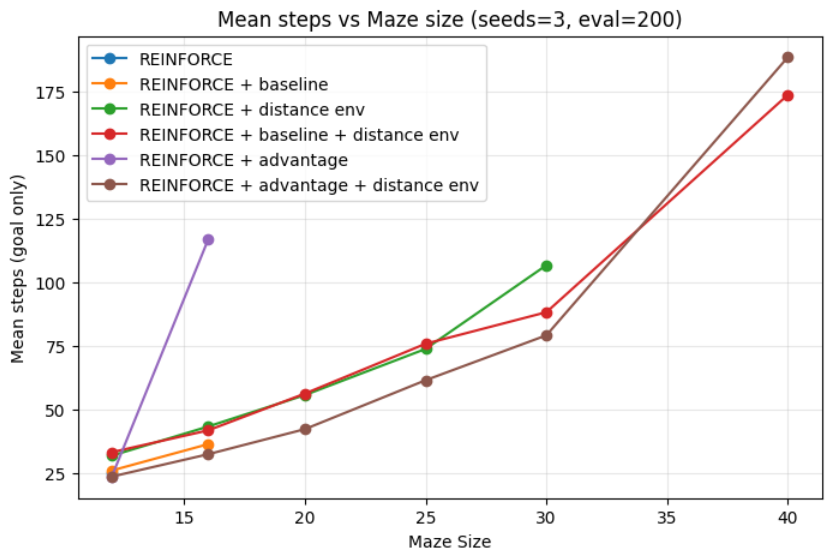
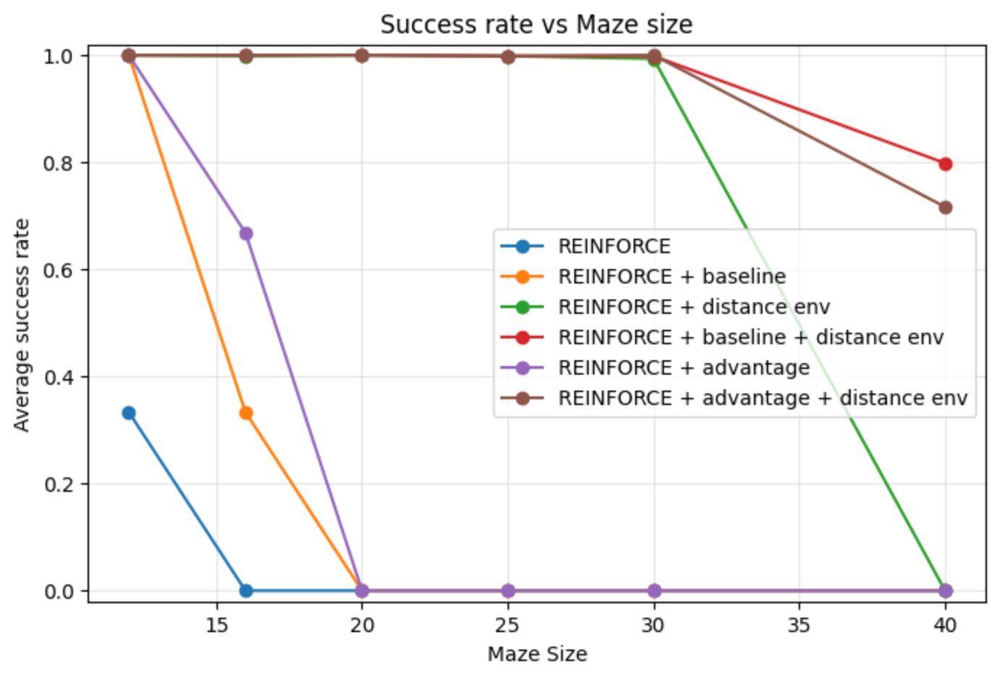

# How big of a maze can REINFORCE solve?

This project explores hyperparameters and algorithm modifications for the REINFORCE policy-gradient method applied to shortest-path navigation in 2D mazes. The goal is to solve larger mazes, in fewer steps, with faster and more stable training.

We implement **tabular** (state–action) policies and compare:

- Vanilla REINFORCE  
- REINFORCE with value-function baseline  
- Advantage normalization  
- Entropy regularization  
- Distance-dependent rewards  

We evaluate all methods on **success rate** and **average path length** across different maze sizes. See the notebooks (`exps.ipynb`, `maze_tabular.ipynb`) for experiments and plots.

## Clear Problem Definition

The task is shortest-path navigation in a randomly generated 2D grid maze. The agent starts at the top-left corner and must reach the bottom-right corner while avoiding obstacles, in as few steps as possible.

**Environment dynamics:** The agent occupies a single cell and chooses one of four directions each step. If the chosen move leads into a wall or outside the grid, the agent stays in place. The maze layout (obstacle positions, start, goal) is fixed for the duration of an episode.

**Transitions are deterministic:** given a state and action, the next state is uniquely determined. Stochasticity arises only from the policy (action sampling) and from maze generation across different seeds.

---

## Installation

```bash
git clone <repo-url>
cd rl-course-2026/
pip install -r requirements.txt
```

**Requirements:** `numpy`, `tqdm`, `matplotlib`, `imageio`.

---

## Usage

### Train and evaluate

Build a maze environment, pick a training method, and run:

```python
from tabular_policy_maze.maze_env import MazeEnv, MazeEnvWithDistanceReward
from tabular_policy_maze.reinforce import (
    train_reinforce,
    train_reinforce_with_baseline,
    train_reinforce_with_advantage,
    train_reinforce_with_advantage_entropy,
)
from tabular_policy_maze.util import build_maze_env, benchmark

# Single run: build env, train, get policy (theta) and learning curve (mean_returns)
env = build_maze_env(MazeEnv, size=12, obstacle_pct=0.25, seed=42, max_steps=300)
theta, mean_returns = train_reinforce_with_advantage_entropy(
    env, n_iter=100, n_episodes=64, alpha=0.1, gamma=1.0, alpha_v=0.05, entropy_beta=0.01
)

# Benchmark: multiple seeds, report success rate and mean steps to goal
summary = benchmark(
    train_method=train_reinforce_with_advantage_entropy,
    train_arguments={"n_iter": 100, "n_episodes": 64, "alpha": 0.1, "gamma": 1.0, "alpha_v": 0.05, "entropy_beta": 0.01},
    maze_class=MazeEnv,
    maze_arguments={"size": 12, "obstacle_pct": 0.25, "max_steps": 300},
    n_seeds=5,
    n_eval=200,
)
```

### Visualize trajectory and save GIF

After training, you can plot a single trajectory or render the agent’s walk as a GIF:

```python
from tabular_policy_maze.util import plot_maze_with_trajectory, create_gif

# Static plot (one sampled trajectory)
plot_maze_with_trajectory(env, theta, title="Policy trajectory")
plt.show()

# Animated GIF: agent walking through the maze (deterministic = greedy path)
positions, reached_goal = create_gif(
    theta, env,
    output_path="maze_walk.gif",
    fps=4,
    show_path=True,
    deterministic=True,
    last_frame_hold=5,
)
```

---

## Environment

- **State space:** 2D grid of cells. Each cell is either **free (0)** or **obstacle (1)**. Only free cells are valid states; the agent cannot enter walls.
- **Actions:** 4 discrete — up, down, left, right. Invalid moves (into wall or boundary) leave the agent in place.
- **Start / goal:** Fixed at top-left and bottom-right free cells. Mazes are generated so a path between them exists (checked by BFS).
- **Rewards (default):**
  - **Step:** −1 per non-terminal step (encourages shorter paths).
  - **Goal:** 0 on reaching the goal (episode terminates).
- **Episode end:** Reaching the goal or hitting `max_steps` (truncation).
- **Transition function:** Deterministic: agent moves in the direction of the selected action, if it is not wall. If wall: stays in the same state.

Two environment variants:

| Class | Description |
|-------|-------------|
| `MazeEnv` | Constant step reward (−1) and goal reward (0). |
| `MazeEnvWithDistanceReward` | Step reward scaled by Manhattan distance to goal (closer to goal → less negative). Speeds up learning by giving a denser learning signal. |

Environments are built with `build_maze_env(maze_env_class, size, obstacle_pct=0.25, max_steps=200, step_reward=-1.0, goal_reward=0.0, seed=None)`.

---

## Methods
We use a **tabular softmax policy** \(\pi_\theta(a|s) \propto \exp(\theta_{s,a})\) and optimize it with policy gradients. All variants follow the same structure: collect trajectories, compute (possibly modified) gradient contributions, update \(\theta\).

1. **REINFORCE (vanilla)**  
   Gradient estimate: \(\hat{g} = \sum_t \nabla \log \pi_\theta(a_t|s_t)\, G_t\), where \(G_t\) is the return from time \(t\). High variance; learning is slow and unstable on larger mazes.

2. **REINFORCE with baseline**  
   Same gradient form but we use \(G_t - V(s_t)\) instead of \(G_t\), where \(V(s)\) is a learned state-value function (updated by MC or similar). The baseline reduces variance without biasing the gradient, improving stability and convergence.

3. **Advantage normalization**  
   We normalize the advantages \((G_t - V(s_t))\) over the batch (e.g. subtract mean, divide by std). This further stabilizes updates and often improves performance compared to the raw baseline.

4. **Entropy regularization**  
   We add a term that encourages exploration by penalizing low entropy of \(\pi_\theta(\cdot|s)\). This helps avoid early convergence to suboptimal policies and can improve success rate and path quality.

5. **Distance-dependent reward**  
   Used in `MazeEnvWithDistanceReward`: step reward depends on distance to goal. This provides a denser signal (getting closer is better), which accelerates training and helps the agent find the goal in larger mazes.

In the report and notebooks we compare these variants (excluding GAE) in terms of success rate and average number of steps to reach the goal.

---

## Results

### Reproducibility

Hyperparameters for all reported experiments are stored in the `.json` files in the `results` folder.

### GIF: agent walking the maze




### Mean steps vs maze size




### Success rate vs maze size



---

## Project structure

```
rl-course-2026/
├── README.md
├── requirements.txt
├── exps.ipynb          # Main experiments and benchmarks
├── maze_tabular.ipynb  # Additional maze/tabular experiments
└── tabular_policy_maze/
    ├── maze_env.py     # MazeEnv, MazeEnvWithDistanceReward, plot_maze
    ├── reinforce.py    # Policy + all REINFORCE training variants
    └── util.py        # build_maze_env, benchmark, plot_maze_with_trajectory, create_gif
```